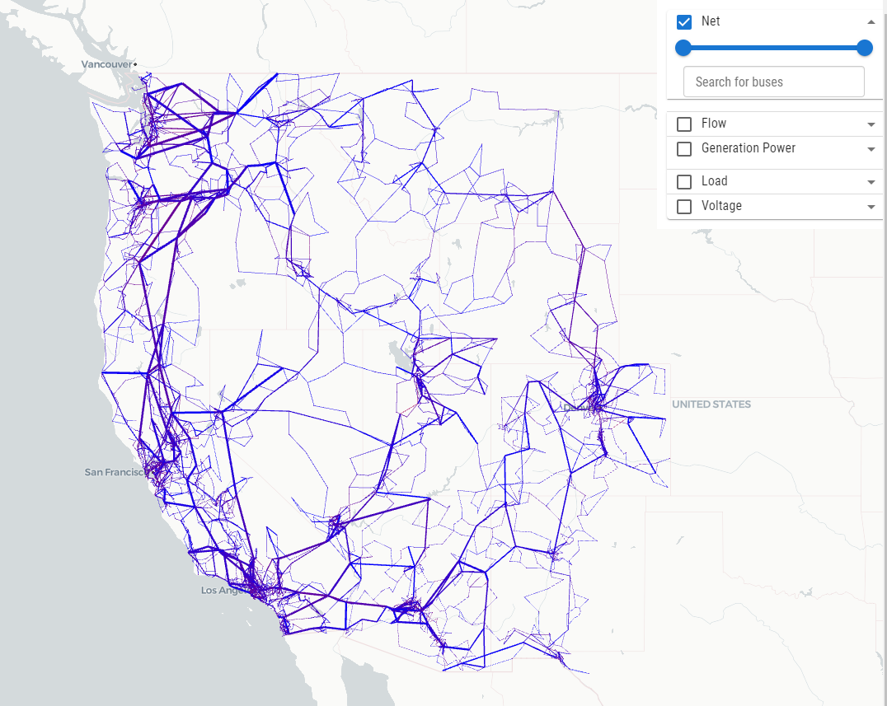
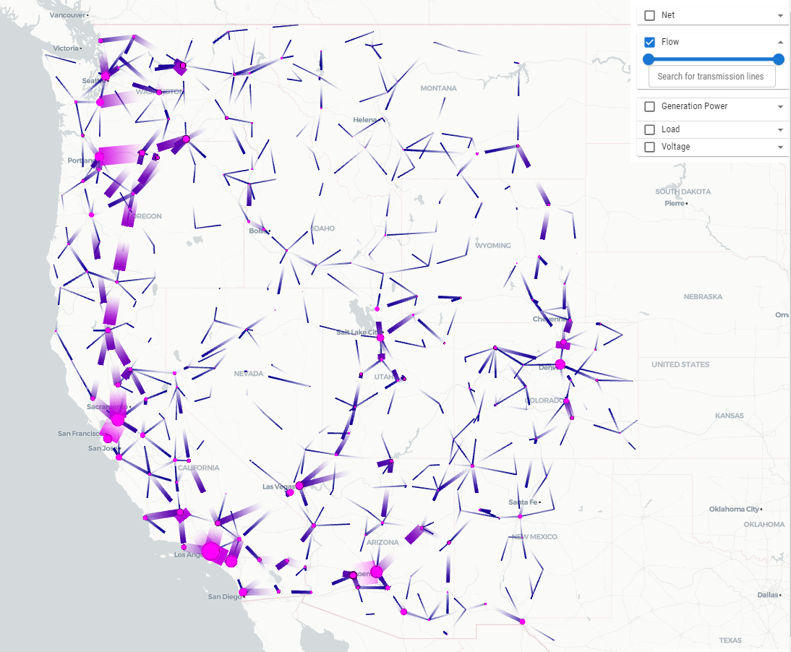
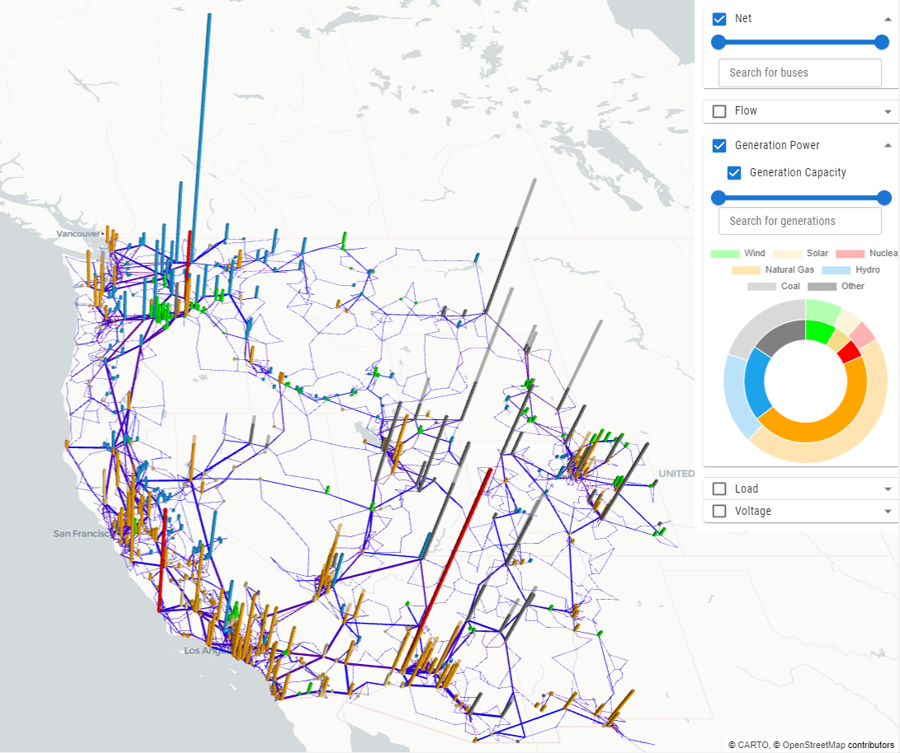
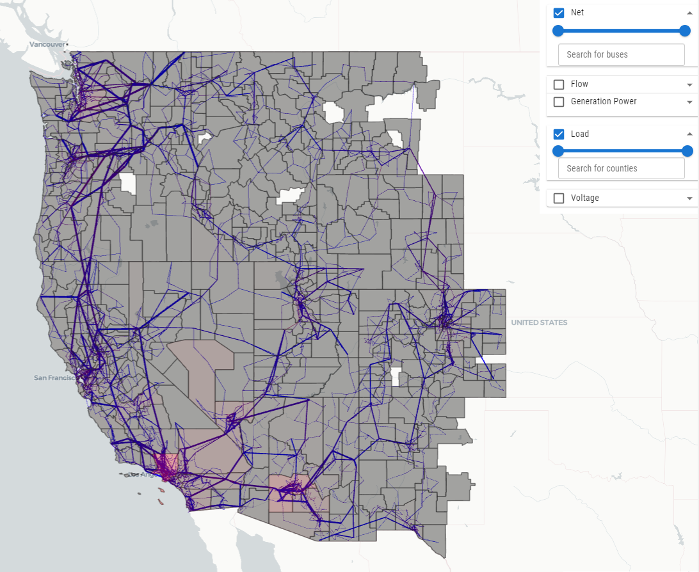
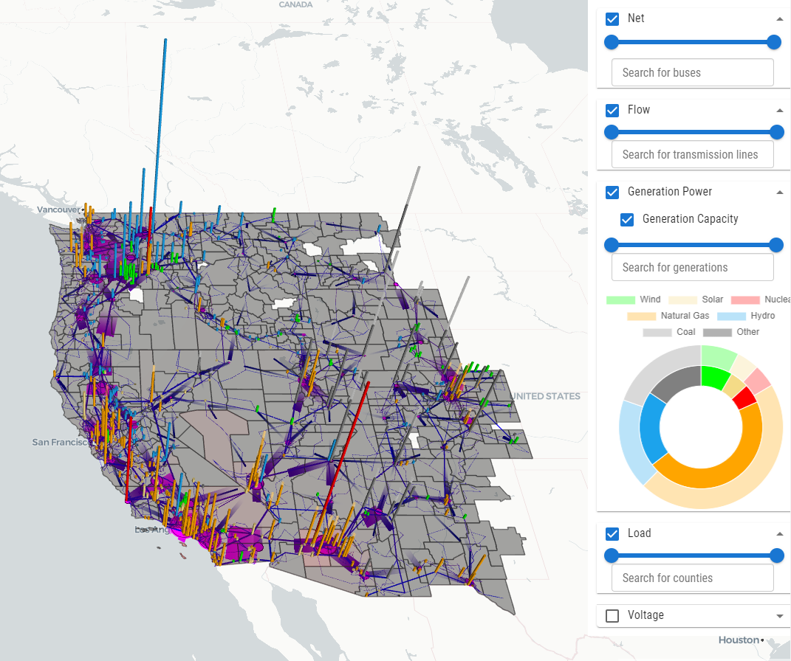
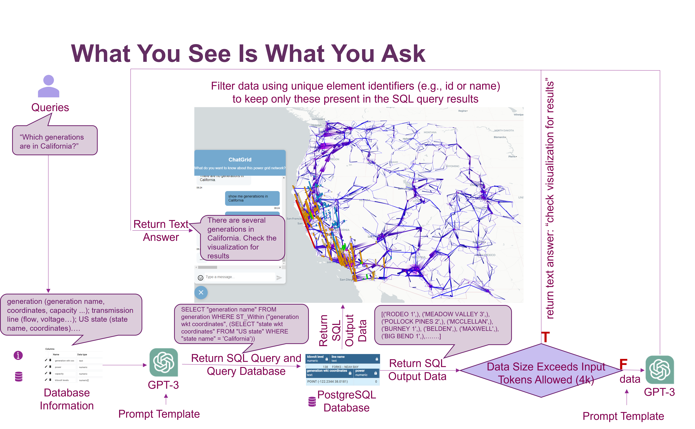

# ExaGO visualization (experimental)

ExaGO has an experimental visualization platform for visualizing the results
of OPFLOW on a map provided the geospatial coordinates for the network are
available. On launching the visualization, a webpage displays the given
power system network overlayed on a geospatial map. The (experimental)
visualization features include:

- Map-based network layout of the grid
- Reading in the grid data through a geojson file.
- Fly-in (zoom in) on bus, branch, county
- County-based load and voltage heatmaps
- Bar chart layer and double pie-chart for generation dispatch and capacity
- Filters based on network voltage, generation dispatch level, and
  voltage/load level
- Zoomed-in display of county load or voltage (aggregated)

## Enhanced features

The following features have been added on top of the base visualization:

### Settings panel

A persistent settings dialog (gear icon in the control panel) allows users
to configure visualization options without reloading. Settings are saved
to the browser's local storage and restored on next launch. Configurable
options include:

- **Map style** — switch between Positron, Positron (no labels), Dark
  Matter, or no basemap
- **Active power flow layer** — toggle animation, clustering, and adaptive
  scales; set gradient colour (low → high loading) and overall layer opacity
- **Reactive power flow layer** — same options as the active flow layer,
  with independent colour and opacity controls
- **Network display** — adjust node circle radius (px), line width scale,
  and toggle/colour county and state boundary overlays
- **Generation bars** — set bar radius (km), height scale (MW multiplier),
  and enable zoom-adaptive radius so bars maintain a consistent on-screen
  size as the user zooms in and out

### Hover tooltips

Rich hover tooltips appear when the cursor moves over network elements:

- **Bus (substation)** — shows voltage level (kV), voltage magnitude (p.u.),
  voltage angle (°), real/reactive load (MW/MVAR), bus type, area, and zone
- **Transmission line** — shows voltage (kV), active/reactive power from/to
  (MW/MVAR), thermal rating (MW), and P loading % with colour coding (green <
  70%, amber 70–90%, red > 90%)
- **Generator bar** — shows generator name, fuel type, bus, area, zone,
  output (Pg MW), capacity (Pcap MW), loading %, reactive power (Qg MVAR),
  and voltage setpoint (Vg p.u.); all fields render conditionally based on
  data availability

### Control panel

All controls are consolidated into a single right-hand panel (300 px wide):

- **Case selector** — dropdown to switch between pre-loaded network
  cases; the map automatically flies to the extent of the newly loaded
  dataset while preserving the current camera pitch
- **File upload** — upload any compatible `.json` case file directly
  from the panel
- **Screenshot** — capture the current map view (including all active
  layers) as a PNG, preview the thumbnail in the panel, and download with
  a single click

## Preparing input data files for visualization

The visualization uses a `JSON` formatted file as an input. This `JSON`
file has a specific structure (To do: explain structure for the file)
and there are several sample files for different network in the `data`
subdirectory.  This input JSON file can be either created externally OR
generated as an output of the `OPFLOW` application. When using OPFLOW,
the following command will generate the input JSON file. The generated
file will be name as `opflowout.json`.

```
./opflow -netfile <netfile> -save_output -opflow_output_format JSON -gicfile <gicfilename>
```

Note that the `OPFLOW` application is available in the `$EXAGO_INSTALL/bin`
directory where `$EXAGO_INSTALL` is the ExaGO installation directory.

The above command will run a `OPFLOW` on the given network and generate an
output file called `opflowout.json`. The `-gicfile` is an additional option
one can provide to provide the file that has the geospatial coordinates
(latitude/longitude) for the network. If the geospatial coordinates are
not provided then OPFLOW draws the network as a circle. It is highly
recommended that one provides the geospatial coordinate file as an input
to display the network correctly on the map. The geospatial coordinate
file should have the same format as used for the [Electric Grid Test Case
Repository](https://electricgrids.engr.tamu.edu/) synthetic networks.

For example, with Texas 2000 bus synthetic data, executing the following
`opflow` will produce the `opflowout.json` output. The case files are
provided in the data folder.

```
opflow -netfile case_ACTIVSg2000.m -save_output -opflow_output_format JSON -gicfile ACTIVSg2000_GIC_data.gic
```

Next, you can put the `opflowout.json` file in the `viz/data` folder. When
the visualization tool will be launched, it will find all `*.json` files in
the `viz/data` folder and show a list of files in the top right corner. The
first item in the list will be visualized as default. Users can change the
selection and the visualization will be updated accordingly. In addition,
users can upload a compatible `json` case file (generated via `opflow`)
using the file upload button next to the selection list.

## Launch visualization

To launch the visualization, run

```
$EXAGO_INSTALL/share/exago/viz/server.py
```

This will start a server that you can visit at `http://localhost:8080`
showing the visualization of the network at `data/opflowout.json`. Other
networks may be loaded by uploading the JSON representation using button
under the `Upload JSON` header.

The figures below show the visualization of the synthetic electric grid. The data
for developing this visualization was created by merging the synthetic
dataset for the [Eastern], [Western], and [Texas] interconnects from the
[Electric Grid Test Case Repository]

[Eastern]: https://electricgrids.engr.tamu.edu/electric-grid-test-cases/activsg70k/
[Western]: https://electricgrids.engr.tamu.edu/electric-grid-test-cases/activsg10k/
[Texas]: https://electricgrids.engr.tamu.edu/electric-grid-test-cases/activsg2000/
[Electric Grid Test Case Repository]: https://electricgrids.engr.tamu.edu/

### 2D synthetic US western grid network display



### 2D synthetic US western grid tranmission line flow display



### 2.5D synthetic US western grid network display with generation overlapped and doughnut chart for generataion mix



### 2.5D synthetic US western grid displaying load profile by counties



### 2.5D synthetic US western grid displaying network, flow, generation, and load



### Demo

See [here](../tutorials/demo1.ipynb)

## ChatGrid

ChatGrid is a natural language query tool for ExaGO visualizations. ChatGrid
allows users to query on ExaGO visualizations through natural language
and returns text summaries and visual outputs as answers. The following
flow chart shows the architecture design of ChatGrid.



### Preparing the source tree

Behind the scenes, an LLM translates natural language queries into SQL queries
to retrieve data from a database. It may be set up using the following steps.

1. Convert data formats.

    First, we need to convert the ExaGO output `.json` files to `.csv`
    files. Ensure `opflowout.json` is present in `viz/data` as this is
    the network first loaded by the visualization interface. Then, after
    ensuring that your local Python install has the requisite dependencies,
    from `viz/data` in the source checkout, run:

    ```
    $ python jsontocsv.py opflowout.json
    ```

2. Configure large language model API keys

    Next, we need to configure the backend so that it is able to use a
    large language model API provider. First, within `viz/backend`, copy
    `config.example.py` to `config.py`. Then, open `config.py` and set
    `llm_provider` to the desired LLM provider, then set the corresponding
    `<llm_provider>_key` variable to your API key and if desired, the
    `<llm_provider>_model` variable to something other than the default.

After these steps and rebuilding/reinstalling ExaGO, running the visualization
as normal will also now provide support for ChatGrid.
